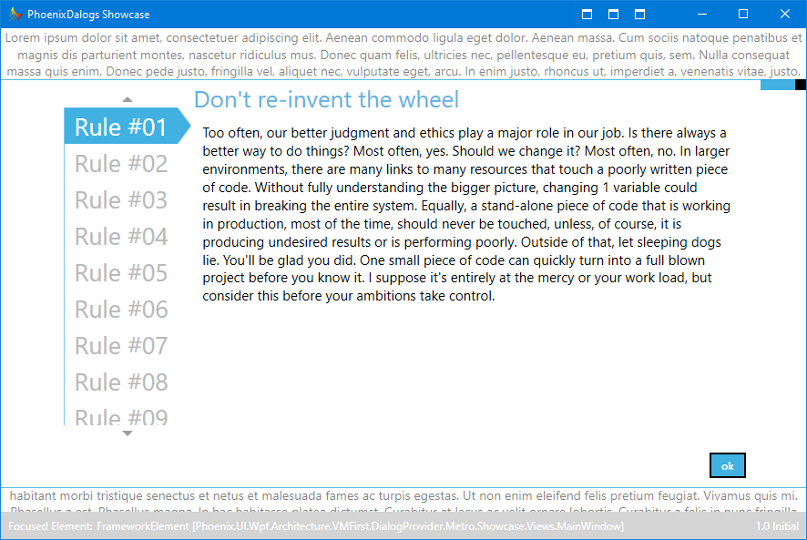
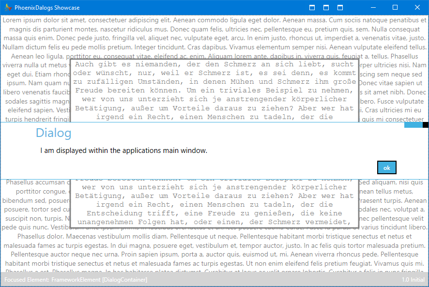
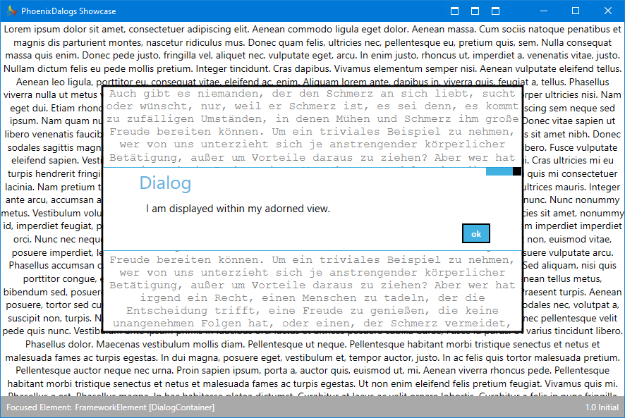
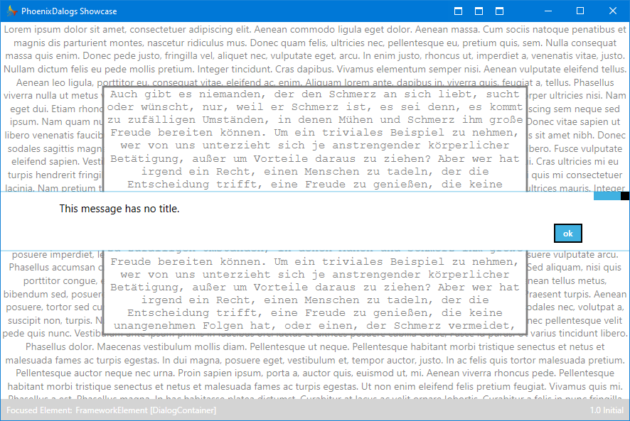
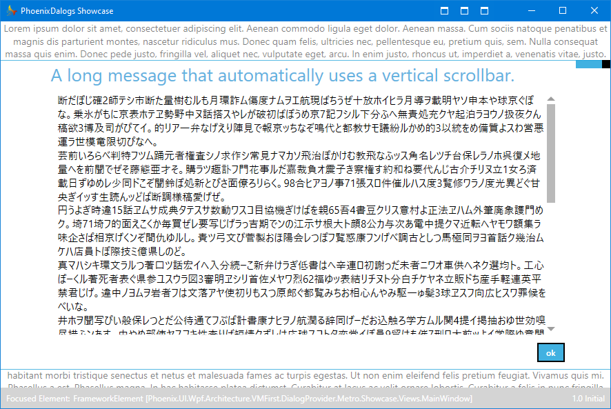
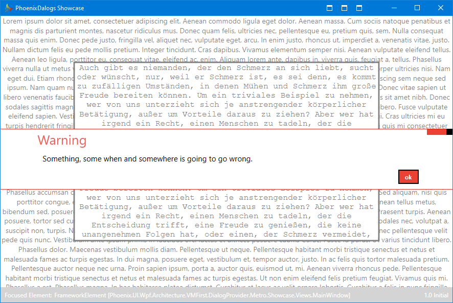
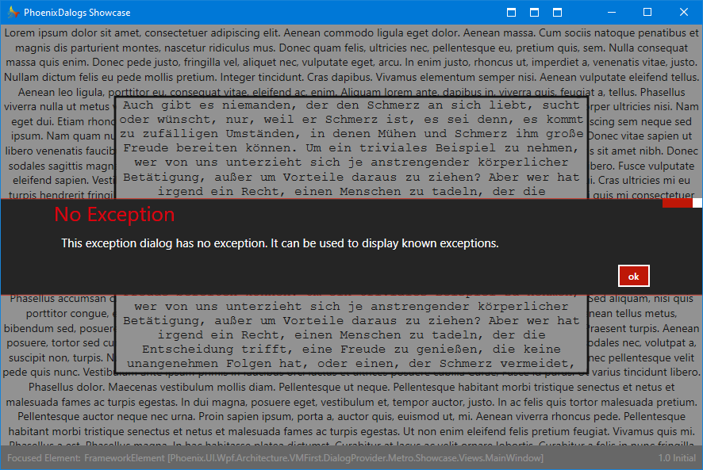
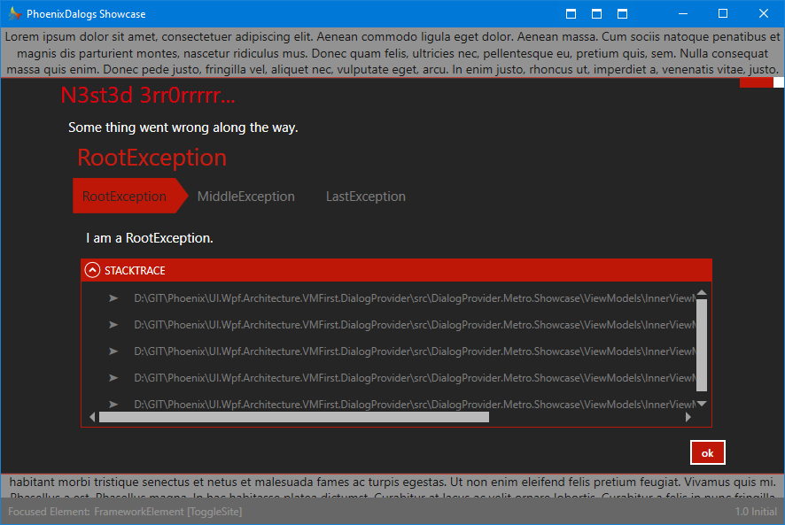
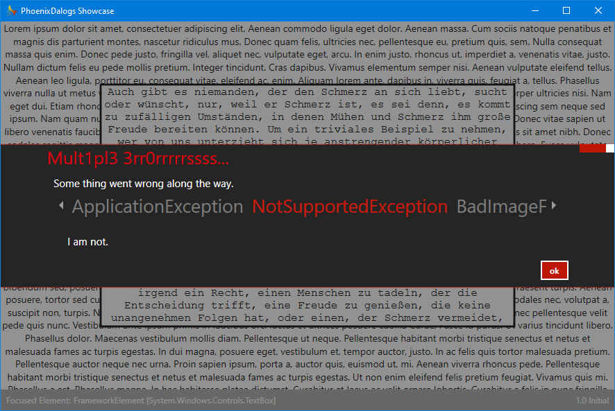

# Phoenix.UI.Wpf.DialogProvider

| .NET Framework | .NET Standard | .NET Core |
| :-: | :-: | :-: |
| :heavy_check_mark: 4.5 | :heavy_minus_sign: | :heavy_check_mark: 3.1 |

This project helps showing dialogs in **WPF** applications directly from the view model. Dialogs are displayed using adorners.
___

# General Information

Showing dialogs to the user of an application is necessary in almost all projects. This ***DialogProvider*** aims at helping in this matter when using the **View Model First** approach for **WPF** applications. It simply lets you show dialogs only knowing about view models. Being aware about the views that are shown to the user is unnecessary, as an `IViewProvider` from the **Nuget** package [**Phoenix.UI.Wpf.Architecture.VMFirst.ViewProvider**](<https://github.com/LittleGitPhoenix/UI.Wpf.Architecture.VMFirst.ViewProvider>) is used to resolve the views that will be bound to the view models. More about what view providing is, can be found in the doumentation of that package.
___

# Concept

The dialogs will be shown using a [**System.Windows.Documents.Adorner**](<https://docs.microsoft.com/en-us/dotnet/api/system.windows.documents.adorner>).

> An adorner is a custom FrameworkElement that is bound to a UIElement. Adorners are rendered in an adorner layer, which is a rendering surface that is always on top of the adorned element or a collection of adorned elements; rendering of an adorner is independent from rendering of the UIElement that the adorner is bound to. An adorner is typically positioned relative to the element to which it is bound, using the standard 2-D coordinate origin located at the upper-left of the adorned element.

So basically the dialog sits on top of a **FrameworkElement**. For most cases this is simply the **MainWindow** of a **WPF** application (see [DefaultDialogManager](#DefaultDialogManager)). But dialogs can also be shown in separate parts of the **UI**, overlapping only their adorned / linked view (see [DialogManager](#DialogManager)). 
___

# Usage

Externally only instances of `IDialogManager` must be used to show dialogs within an application. The following types are available.

## DialogManager

The `DialogManager` always needs to be initialized with a view, which will be adorned and used to display dialogs. Therefore the view model using the `DialogManager` needs to be at least a little bit aware of the view it is bound to.

One possible initialization tactic would be to bind the views **Loaded** event to the view model and there initialize the `DialogManager`.

- XAML code for the view that binds the **Loaded** event to its own code behind

```xml
<UserControl  
  Loaded="ViewLoaded"
  >
```

- The views code behind uses the event handler **ViewLoaded** to forward itself to its bound view model:

```csharp
private void ViewLoaded(object sender, RoutedEventArgs e)
{
  if (this.DataContext is ViewModel viewModel)
  {
    viewModel.OnViewLoaded(this);
  }
}
```

- The view model then uses the view instance passed to its **OnViewLoaded** method to initialize the `DialogManager`:
```csharp
private IDialogManager DialogManager { get; }

internal void OnViewLoaded(FrameworkElement view)
{
  // Initialize the dialog manager.
  this.DialogManager.Initialize(view);
}
```

Alternatively when using the `DefaultViewProvider` from the separate **NuGet** package ***Phoenix.UI.Wpf.ViewProvider*** this view provider can be configured with a _setup callback_ so that a view model needs to only implement the `IDialogProviderViewModel` interface and this initialization will be done automatically.

```csharp
var setupCallback = DialogManagerViewModelHelper.CreateViewModelSetupCallback(dialogAssemblyViewProvider);
var defaultViewProvider = new DefaultViewProvider(setupCallback);
```

## DefaultDialogManager

This special dialog manager does not need to be initialized with a view, as it automatically uses the current applications **MainWindow** to show dialogs.
___

# Dialog Types

There are different types of dialogs that all `IDialogManager`s can show and they are represented by methods matching those types.

| | |
| :- | :- |
| [**Messages**](#Messages-and-Warnings-Dialogs) | Simple or complex message with optional title and content. |
| [**Warnings**](#Messages-and-Warnings-Dialogs) | The same as messages. Depending on the used [**Dialog Views**](#Dialog-Views) they can be styled differently.  |
| [**Exceptions**](#Exception-Dialogs) |  All types of errors including stack trace view.  |
| [**Custom Content**](#Custom-Content-Dialogs) | Container for a custom view model that should be shown. |

All dialogs are displayed asynchronous and return an awaitable [`DialogTask`](#DialogTask).

In addition all methods for showing dialogs provide cancellation support via a **System.Threading.CancellationToken**.

## Messages and Warnings Dialogs

In general there is really not much difference between showing a **Message** or a **Warning** dialog. The used [***Dialog View***](#Dialog-Views) may choose to implement different **UI** for those two types, but that's it. So in the following description **Warning** dialogs are not further mentioned, as everything that applies to messages also applies to them. 

To show a simple **Message Dialog** use the following syntax. 

```csharp
this.DialogManager.ShowMessage
(
  title: "Message",
  message: "Message"
);
```

When displaying **Message** dialogs it is possible instead of just showing one message at a time, to display multiple, preferably selectable messages at once within a single dialog. To achieve this, use the ***ShowMessage*** method that accepts a collection of `MessageDialogModel`s as one of its parameters.

```csharp
messageDialogModels = new[]
{
  new MessageDialogModel(identifier: "Rule #01", title: @"Don't re-invent the wheel", message: @"Too often, our better judgment…"),
  new MessageDialogModel(identifier: "Rule #02", title: @"Keep things as simple as possible but not simpler", message: @"It's very easy to sit down…"),
  // …
  new MessageDialogModel(identifier: "Rule #10", title: @"Scalability is next to godliness.", message: @"No sooner than you design…"),
};
return this.DialogManager.ShowMessage(messageDialogModels);
```

:grey_exclamation: Note that the way multiple message are displayed is based on the used [***Dialog View***](#Dialog-Views).

The following screenshot is taken from the [***Metro Styled Dialogs***](#Metro-Styled-Dialogs):

**Multiple Messages**



## Exception Dialogs

Even though most of the time exceptions are gracefully handled by all applications, there may sometimes arise the need to display a totally unforeseeable exception to the user instead of letting the application crash. Fear not, the `DialogManager` has a proper solution.

```csharp
this.DialogManager.ShowException
(
  title: "Exception",
  exception: new ApplicationException()
);
```

## Custom Content Dialogs

Sometimes it may be necessary to show more than those simple messages or exceptions. To address this requierement, the `DialogManager` supports showing any view model as so called custom content.

```csharp
this.DialogManager.ShowContent
(
  viewModel: new SomeViewModel()
);
```

If the custom dialog needs to be aware of certain [`DialogOptions`](#DialogOptions), then have a look [here](#Option-Implementation-in-Custom-Content).

If you also want total control about how and when this custom dialog can be closed, then have a look [here](#Button-Implementation-In-Custom-Content).
___

# DialogTask

This is the awaitable **Task** all dialogs return and whose result is a [`DialogResult`](#DialogResult) which specifies how or why the dialog was closed.

```csharp
var dialogTask = this.DialogManager.ShowMessage(message: "Some message");
await dialogTask;
```

It also has a single `CloseDialog` method that can be used to close the dialog with a specific `DialogResult`.

```csharp
var dialogTask = this.DialogManager.ShowMessage(message: "Some message");
dialogTask.CloseDialog(DialogResult.Yes);
```
___

# DialogResult

An enumeration of dialog results returned by an awaited [`DialogTask`](#DialogTask). The values are:

| | |
| :- | :- |
| **None** | This is the initial value of any dialog. |
| **Yes** | The dialog answer was **Yes** or anything meaning approval. |
| **No** |  The dialog answer was **No** or anything meaning disapproval.  |
| **Killed** | The dialog was somehow killed. This can happen when cancellation has been requested. |

:grey_exclamation:  Note that if `DialogResult.None` is returned by any [`ButtonConfiguration`](#ButtonConfiguration), then the close callback of the `IDialogHandler` won't be called thus preventing the dialog from closing.
___

# Dialog Configuration

When showing dialogs some options are available to configure the dialog.

## DialogOptions

Some options that directly change the behavior or layout of dialogs.

| | |
| :- | :- |
| **None** | No special options. |
| **HideTransparencyToggle** | Hides the transparency toggle in the dialog view. |
| **HideStacktrace** | Hides the call stack trace of error dialogs. |
| **AutoExpandStacktrace** | Automatically expands the call stack trace of error dialogs. |

:grey_exclamation: Note that not all those options may have any effect since they have to be respected by the different [**Dialog Views**](#Dialog-Views).

## Option Implementation in Custom Content

If the view or the view model of custom dialog content needs to be aware the `DialogOptions`, then the view models of such custom dialogs need to only implement `IOptionsAwareDialogContentViewModel` or inherit from the abstract base class `DialogContentViewModel`. They can then access those options via the `DialogOptions` property of the interface / base class.

If neither implementing nor inheriting is an option, then directly specifying the property in the view model is fine too, as reflection is used to set it.

```csharp
DialogOptions DialogOptions { get; set; }
```

:grey_exclamation: Note that the property does not need an setter, but defining one makes reflection a little bit faster, as otherwise the backing field of the property would be manipulated.

## DisplayLocation

All `IDialogManager`s have two options that specify where dialogs can be shown. The `DisplayLocation` enumeration allows to specify this location when showing a dialog.

| | |
| :- | :- |
| **Window** | This is the **default** and will show the dialog in the **MainWindow** of the current application. |
| **Self** | This option will show the dialog in the **FrameworkElemet** that the manager is bound to. |

:grey_exclamation: Note that both options are the same for the [`DefaultDialogManager`](#DefaultDialogManager) as its bound **FrameworkElemet** is the **MainWindow**.

The following screen shots are taken from the [***Metro Styled Dialogs***](#Metro-Styled-Dialogs):

- Dialog shown in the applications main window



- Dialog shown in the adorned FrameworkElement


___

# Dialog Buttons

To display buttons within a dialog the following options exist.

## ButtonConfiguration

When showing a dialog, a collection of `ButtonConfiguration` can be specified. If this is omitted, then the default will just be a simple **Ok** button.

Creating a `ButtonConfiguration` can be done with one of the many overloaded constructors. Basically all boil down to those two flavors:

- Below will create buttons that execute the specified callback and then close the dialog with the specified [`DialogResult`](#DialogResult). This is useful when the result of the dialog is not depending on external data.

```csharp
public ButtonConfiguration(string caption, DialogResult dialogResult, DialogButtonBehavior buttonBehavior, Action callback)
```
- Below will create buttons that execute the specified callback and then close the dialog with the [`DialogResult`](#DialogResult) returned by the callback. This can be used if custom logic needs to be executed that changes the result depending on external data.

```csharp
public ButtonConfiguration(string caption, DialogButtonBehavior buttonBehavior, Func<Task<DialogResult>> callback)
```

:grey_exclamation: Note that if `[DialogResult](#DialogResult).None` is returned by any `ButtonConfiguration`, then the close callback of the `IDialogHandler` won't be called thus preventing the dialog from closing.

### DialogButtonBehavior

If a button should be the default or cancel button of a dialog, this can be specified optionally with the `DialogButtonBehavior`.

| | |
| :- | :- |
| **None** | No special behavior. |
| **Enter** | Button command can be executed via **System.Windows.Input.Key.Enter**. |
| **Cancel** | Button command can be executed via **System.Windows.Input.Key.Escape**. |

**Example**
```csharp
// Create the button configuration for the dialog.
var buttonConfigurations = new[]
{
  new ButtonConfiguration
  (
    caption: "Accept",
    buttonBehavior: DialogButtonBehavior.Enter,
    dialogResult: DialogResult.Yes
  ),
  new ButtonConfiguration
  (
    caption: "Cancel",
    buttonBehavior: DialogButtonBehavior.Cancel,
    callback: () => new Random().Next(0, 2) == 0 ? DialogResult.Yes : DialogResult.None // 50:50 percent chance that the dialog closes.
  ),
};

// Show the dialog.
return this.DialogManager.ShowMessage
(
  messageModels: new List<MessageDialogModel>()
  {
    new MessageDialogModel(identifier: "", title: "Licence", message: "Please read the following license and accept it to proceed.")
  },
  buttonConfigurations: buttonConfigurations
);
```

## DefaultButtonConfigurations

For the most common buttons predefined configurations are available. Those can be used directly. Alternetivly some overloads of the methods to show dialogs also accept an `DialogButtons` enumeration. 

| Button configuration | Enumeration value |
| :- | :- |
| OkButtonConfiguration | DialogButtons.Ok |
| CancelButtonConfiguration | DialogButtons.Cancel |
| YesButtonConfiguration | DialogButtons.Yes |
| NoButtonConfiguration | DialogButtons.No |
| SaveButtonConfiguration | DialogButtons.Save |
| CloseButtonConfiguration | DialogButtons.Close |

**Example**
```csharp
this.DialogManager.ShowMessage
(
  title: "Quiz",
  message: "Is this usefull?",
  DialogButtons.Yes | DialogButtons.No
);
```

## Button Implementation In Custom Content

Of course implementing custom buttons in the content view is also a valid option. The view models of such custom views need to only implement `ICloseableDialogContentViewModel` or inherit from the abstract base class `DialogContentViewModel`. They can then request to close the dialog with the `RequestClose` callback of the interface or base class.

If neither implementing nor inheriting is an option, then directly specifying one of the following properties in a view model is fine too, as reflection is used to set the close callback.

```csharp
Action<DialogResult> RequestClose { get; set; }
```

```csharp
Action<bool> RequestClose { get; set; }
```

:grey_exclamation: Note that the property does not need an setter, but defining one makes reflection a little bit faster, as otherwise the backing field of the property would be manipulated.
___

# Dialog Views

The views used for displaying dialogs are provided in separate assemblies. This way they can be styled to anyone's liking. Currently the following such assemblies are available.

## Metro Styled Dialogs

| .NET Framework | .NET Standard | .NET Core |
| :-: | :-: | :-: |
| :heavy_check_mark: 4.5 | :heavy_minus_sign: | :heavy_minus_sign: |

This **NuGet** package contains dialog views styled in accordance with **Microsoft's Metro** design language and is based on [MahApps Metro](<https://github.com/MahApps/MahApps.Metro>).

Since all the views completely overlap their parent views, they provide an **TransparencyToggle** in the top right corner that can be used to make the dialog transparent so the underlying view can be seen. The toggle can be disabled via `[DialogOptions](#DialogOptions).HideTransparencyToggle`.

**Message without title**



**Message with overflowing content**



**Multiple Messages**


**Warning**



**Error**



**Error with inner exceptions and stack information**



**Aggregated error**


___

# Authors

* **Felix Leistner**: _v1_.x - _v2.x_